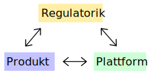

# Cloud Migration

Die Entscheidung für eine Cloud-Strategie kann diverse Ursachen und Beweggründe haben.
Das Warum ist für die erfolgreiche Umsetzung einer Cloud-Strategie nicht entscheidend, viel mehr sind es die Rahmenbedingungen innerhalb derer die Umsetzung erfolgt.

## Cloud-Strategie

Die Umsetzung einer Cloud-Strategie findet meist in folgendem Spannungsfeld statt:

* **Regulatorik** - Hierunter fallen alle unabdingbaren Rahmenbedingungen wie Datenschutz, Compliance, Rechts- oder Unternehmensvorgaben ("Governance")
* **Produkt** - Fach-Teams, deren primäre Aufgabe das Liefern von Business-Value ist
* **Plattform** - Technische wie organisatorische Basis auf der die Fach-Teams arbeiten

Eine Cloud-Migration erfolgt zumeist während des laufenden Geschäftsbetriebs. Neben dem Einführen neuer Technologien und Methodiken in der IT, ist das Bewusstsein um die Änderungen die der Einsatz der Cloud idealerweise mit sich bringt, auch in den Fachbereichen absolut notwendig.

**Es wird generell davon ausgegangen, dass eine Cloud-Strategie nicht nur eine Änderung im Hosting bedeutet, sondern gleichermaßen eine Transformation in eine DevOps-Organisationsform vollzogen wird, also Fach-Teams eigenständig und selbstverantwortlich lieferfähig gemacht werden sollen.** _(vgl. [Organisatonsform](Organisation.md))_

## Rahmenbedingungen

Die folgenden Umstände werden als förderlich in der Umsetzung einer Cloud-Strategie angesehen.
Diese können grob in organisatorische und technische Faktoren unterteilt werden, wobei die Abgrenzung nicht immer trennscharf ist.
Des Weiteren ist eine zeitliche Dimension vorhanden, welche Aspekte bereits vor dem operativen Beginn der Cloud Migration implementiert werden sollten (markiert mit _(0)_), was zu Beginn vorrangig umgesetzt werden sollte ( _(1)_ ), und letztendlich welche Themen im Laufe einer Migration angegangen werden sollten ( _(2)_ ).

### Organisatorisch

* **Dedizierte Weiterbildungszeit** _(0)_ - Der technologische Wandel durch eine Cloud-Migration ist meist im Tagesgeschäft nicht angemessen unterzubringen. Signifikante Zeit sollte regelmäßig für das Aneignen der neuen Technologien reserviert werden. Eine Kombination aus Schulungsmaßnahmen und Selbststudium verspricht den besten Erfolg.
* **Kontinuierlicher Lifecycle** _(0)_ - Die Wolken bewegen sich schnell. Das Bewusstsein um die Notwendigkeit der ständigen Erneuerung der Systeme muss sowohl beim Management als auch in den Teams vorhanden sein. Technische Themen sind neben der Businesspriorisierung unterzubringen. Das Sprichwort "Wir bauen heute die Legacy von morgen", ist in der Cloud allgegenwärtig, dem kann nur durch ständige Anpassung an die technologische Entwicklung entgegen gewirkt werden ("Continuous Refactoring").
* **Frühzeitige Cloud Governance** _(0)_ - Die Möglichkeiten der Cloud sind unerschöpflich, sowohl technisch wie auch finanziell. Sowohl der finanzielle wie auch der regulatorische Aspekt sollten von Anfang an ganzheitlich beachtet werden. Ein zu unkontrollierter Cloud-Move bremst später stark aus oder kann langfristig übermäßig teuer werden.
* **Fehlerkultur** _(1)_ - Besonders in der Anfangsphase der Cloud-Migration wird aus Fehlern gelernt. Ein offener Umgang mit Fehlschlägen hilft Wiederholungen zu vermeiden und kollektiv daraus zu lernen.
* **Community Bildung** _(1)_ - Organisationsdurchdringende Communities helfen die obigen Punkte effizienter umzusetzen. Des Weiteren sind sie ein sehr effizientes Mittel der Wissensverteilung auch organisationseinheitsübergreifend.

### Technisch

* **Evangelisten** _(0)_ - Eine kleine, gut abgestimmte Expertengruppe, die als Enabler alle Teams unterstützen und mitziehen ist eine sehr gute Investition. Wie in der _(vgl. [Organisatonsform](Organisation.md))_ beschrieben, werden Teams erst sinnvoll eigenständig Cloud-Themen voran bringen, wenn zumindest einige Teammitglieder dies aktiv wollen.
* **Explizite Makroarchitektur** _(1)_ - Cloudangebote bieten eine Vielzahl an Integrationstechnologien und -services. Um starken Wildwuchs zu vermeiden, sollten klare Integrationsmuster definiert und befolgt werden. Diese müssen konstant überprüft und ggf. angepasst werden. Hierbei sind sowohl operative Makroarchitekturen (APIs, Daten-Feeds, Events), wie auch analytische Integrationen (Data Warehouse/Lake/Mesh, Reporting) zu betrachten.
* **Cloud Playground** _(1)_ - Ausprobieren beschleunigt die Lernkurve. Eine Möglichkeit, sich ohne finanzielles Risiko mit der gewählten Cloud-Umgebung vertraut zu machen, sollte geschaffen werden. Dabei werden Berührungsängste mit neuen Technologien oder unbekannten (Managed-)Services abgebaut, und Innovationszyklen beschleunigt.
* **Eisbrecher** _(1)_ - Anwendungen ohne großes Geschäftsrisiko eignen sich wunderbar um den Weg zu ebnen und Erfahrungen für komplexe Systeme in der Cloud aufzubauen.
* **x as Code** _(1)_ - Durch die ganzheitliche Lieferfähigkeit bereits in kleinen Teams dank voll-verwalteter Infrastruktur ist Effizenz besonders wichtig. Daher eigenen sich jegliche "as Code" Methoden und Techniken besonders gut um den _Flow_ im Entwicklungsteam zu fördern. "Infrastructure as Code" ist im Cloud-Umfeld sowieso üblich, "Documentation as Code" für Entwickler eine natürliche Sache. Beides sollte gefördert und gegenüber klassischen Methoden bevorzugt werden. Die höchste Ausbaustufe "GitOps", also jeden Aspekt eines Systems deklarativ in der Versionsverwaltung zu speichern sollte auch von Anfang an in Betracht gezogen werden.
* **Automatisierung** _(1)_ - Mit dem vorherigen Punkt einher geht der Anspruch keine manuellen Tätigkeiten in der Cloud-Umgebung zu vollziehen. Das Allermeiste kann, und sollte, automatisiert werden. Von Anfang an; die etwas längere Anlaufzeit ist sehr schnell wieder gutgemacht, da Arbeiten nicht wiederholt durchgeführt und später nach-automatisiert werden müssen.
* **Security Bewusstsein** _(1)_ - Besonders in Public-Cloud Angeboten und öffentlichen ("im Internet") Managed-Services, beginnt Security im Code und betrifft jede einzelne Systemkomponente. Dieses Bewusstsein muss über die gesamte Wertschöpfungskette vorhanden sein.
* **Kostenbewusstsein** _(2)_ - Gleiches wie für Security gilt für Kosten. Ein unbesorgter Umgang mit Service-Kosten ist später oft nur mit großem Aufwand wieder in den Griff zu bekommen. Die Verrechnung der Betriebskosten an den Verursacher ist eine sehr hohe Kunst und macht zu Beginn mangels Erfahrung in den Teams kaum Sinn. Jedoch sollte man dieses Ziel immer vor Augen haben, und sofern möglich, die Weichen richtig stellen.
* **Monitoring & Alerting** _(2)_ - Ebenfalls im Zug der Automatisierung sollte von Anfang an, konsequent auf automatisches Monitoring und ggf. Alerting gesetzt werden. Auch hier gilt: Es bremst zu Beginn etwas und wird deshalb gern vernachlässigt, jedoch ist die manuelle Überwachung und ein späteres Nachrüsten unterm Strich sehr viel aufwändiger.

## Hemmnisse

Einige Punkte, die womöglich nicht ganz offensichtlich sind, erschweren oder bremsen den Höhenflug in die Wolken. Eine Organisation sollte mit diesen potentiellen Problemen bewusst umgehen.

* **Mangel an Kenntnissen bei bestehenden Dienstleistern** - Langjährige Dienstleister sind auf den Stand der Dinge im Unternehmen eingespielt. Innovation wird eher selten durch sie getrieben, sehr schnell werden sie bei internen Strategieänderungen abgehängt, da sie meist nicht in der direkten Kommunikation sind.
* **Not invented here** - Man sollte unbedingt dem Drang widerstehen, Standardprobleme selbst lösen zu wollen. Cloud-Angebote und -Services sind bereits eine sehr starke Abstraktion, es gibt keinen Grund diese selbst weiter zu abstrahieren. Sollte man eine Entwickler-Plattform brauchen oder wollen, dann gibt es Standardprodukte - als OpenSource, mit und ohne Support, wie auch kommerziell. Gerade im Cloud-Umfeld gilt: Die wertvollen und raren eigenen Ressourcen sollten vorrangig das Kerngeschäft unterstützen.
