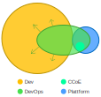

# Organisationsform

Organisationen, die autarke Teams etablieren wollen, haben diverse Topolgien zur Auswahl.

Eine vielfältiger Überblick findet sich z.B. [hier](https://web.devopstopologies.com/).
Die Orientierung gestaltet sich jedoch schwierig, der Austausch der Firmen im Roundtable hat ergeben, dass verschiedene dieser Topologien - mit unterschiedlichem Erfolg - erprobt wurden.

## Idealbild

Ein empfehlenswertes Idealbild könnte wie folgt aussehen:

* **Dev** - Produkt-Team mit Fokus auf Umsetzung/Bereitstellung von Business-Funktionalität. Klassisch sind dies Software-Entwickler:innen ohne besonderen Betriebs- oder Infrastrukturhintergrund.
* **DevOps** - Mitglieder des Produkt-Teams, die neben der Software-Entwicklung auch Infrastruktur-Tätigkeiten und Betrieb übernehmen. Idealerweise besteht das Produkt-Team ausschließlich aus diesem Profil, da dies jedoch utopisch ist, sollte eine ausreichende, mindestens jedoch redundaten Personenanzahl je Team vorhanden sein. Produkt-Teams dürfen und sollen zur Plattform beitragen.
* **CCoE** (Cloud Center of Enablement) - Eine Gruppe von Cloud-Experten, die zwar dem Plattform-Team angehören, aber als Berater allen Teams mit Rat und Tat zur Seite stehen. Ihre primäre Aufgabe ist die Unterstützung der Produkt-Teams in der Umsetzung von Cloud-basierten Lösungen und des Aufbaus der DevOps-Rollen in jedem Team.
* **Plattform** - Dediziertes Team, das den Produkt-Teams die sichere Verwendung der Cloud zugänglich macht. Dies erreichen sie u.a. dadurch, dass sie Werkzeuge für wiederkehrende Herausforderungen bereitstellen und allgemeine Qualitätsanforderungen in der Plattform verankern. Hierzu gehören typischerweise Aufgaben wie:
  * Account-Verwaltung
  * Governance ausüben
  * Zentrale Kosten-Kontrolle
  * Zentrale Dienste betrieben
  * Allgemeingültiges Tooling bereitstellen
Ein wichtiger Aspekt ist, dass die Plattform ein offenes, erweiterbares, kollaboratives System darstellt. Die Plattform ist die Basis, auf der die Produkt-Teams arbeiten, nicht die Grenze innerhalb der sie arbeiten.

## Evolution

Da die meisten Organisationen sich erst zum Idealbild hin entwickeln müssen, bedarf es Strategien, die diese Entwicklung unterstützen.
Der Wechsel in eine DevOps-Organisationsform unter Verwendung von Cloud-Angeboten und -Technologie ist ein Prozess, der aktiv gefördert werden muss.

Im Bestreben um autarke DevOps-Teams (also Teams, die ihr Produkt selbst designen, umsetzen, betreiben und pflegen) muss das Produkt-Team als Einheit, und nicht nur als Summe seiner Team-Mitglieder betrachtet werden.

Die Grundlagen für das Nutzen von Cloud-Angeboten, werden durch ein Plattform-Team gelegt.
Dieses sollte jedoch in Kooperation mit den Produkt-Teams den kleinsten gemeinsamen Nenner ermitteln und bereitstellen, also die Basis die für alle Produkt-Teams gleich ist.
Darauf aufbauend sollte sich die Plattform im Laufe ihrer Nutzung durch die Produkt-Teams nach Bedarf weiterentwickeln.
Das proaktive Bauen einer Plattform und das dann notwendige Anpassen - entweder der Plattform an die Produkt-Teams, oder der von den Produkt-Teams gebauten Lösungen an die Plattform - verursacht hohe Reibungsverluste und hemmt die Effizienz.

Zu Beginn der Einführung von DevOps im Produkt-Team liegt eine Einschätzung der Reife des Teams in Hinblick auf DevOps-Themen (also Infrastrukturaufgaben und Betrieb). Diese Einschätzung sollte durch das Team selbst erfolgen, unterstützt durch Cloud-Experten, die als Katalysatoren dienen.
Neben den notwendigen technischen Kenntnissen und Fähigkeiten ist der Wille zu DevOps der wichtigste Faktor für den Reifegrad jedes Produkt-Teams.

Die Einschätzung des Reifegrad eines Produkt-Teams sollte das Team selbst durchführen, unterstützt durch einen Experten (z.B. des CCoE) der als Katalysator dient. Hierzu eigenen sich standardisierte Fragenkataloge oder aber auch Formate wie ein Assessment Center oder eine Incident-Simulation.

Effizenzsteigernd in der Einführung von DevOps in Produkt-Teams ist auch der Austausch der Produkt-Teams untereinander, um eine Schwarmintelligenz zu bilden.
Leider passiert dies in den wenigsten fällen selbständig.
Daher empfehlen wir die Aufgabe der gezielten Förderung und Moderation bewusst aufzuhängen.

Für einen nachhaltigen Erfolg ist die ganzheitliche Erfahrung des Betriebs im Produkt-Team entscheidend. Es konnte eine Steigerung der Qualität festgestellt werden, sofern Produkt-Teams ihre Lösungen selbst betreiben mussten.
